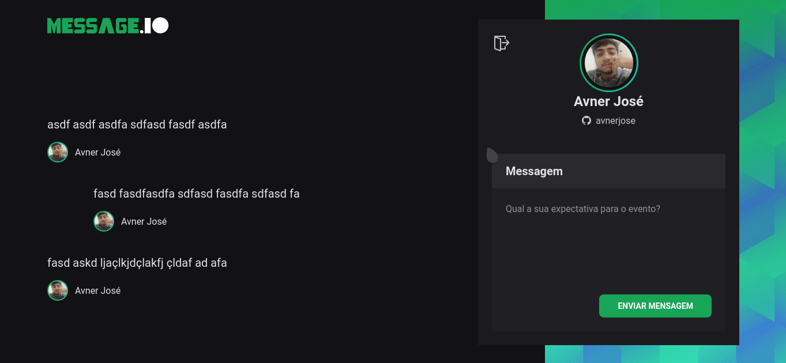

<h1 align="center">
   
</h1>
<h1 align="center" widht="50%">
  
  
  
  
</h1>

## ⚡️ The Project
  Message.Io is a simple ReactJS aplication where you can send a message and see it going live to the [backend](https://github.com/avnerjose/nodejs-message.io-backend) using
  Socket.io and integration with Github authentication.
  
## 🎯 Features
 - Live connection with websockets
 - Animations
 - React Project with [Vite](https://vitejs.dev/)
 - Toast notifications
  
## 🖥️ Used Tecnologies
 - [Vite](https://vitejs.dev/)
 - [ReactJs](https://reactjs.org/)
 - [Styled-Components](https://styled-components.com/)
 - [React Tostify](https://github.com/fkhadra/react-toastify)
 - [Framer Motion](https://www.framer.com/motion/)

## ⚙️ Dependencies
 - [Yarn](https://yarnpkg.com/)
 
## 🚀️ Getting Started

1. Clone this repository: 

```bash
git clone https://github.com/avnerjose/reactjs-message.io-front.git && cd reactjs-message.io-front
```
2. Install all dependencies

```bash
yarn
```
3. Start the app
```bash
yarn dev
```
4. Open [localhost:3000](http://localhost:3000) to see the app working
